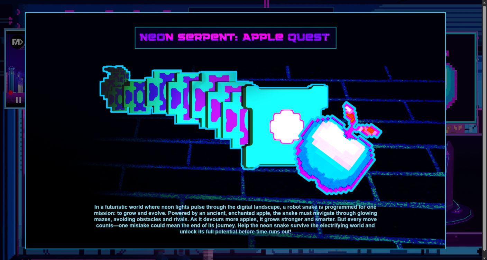
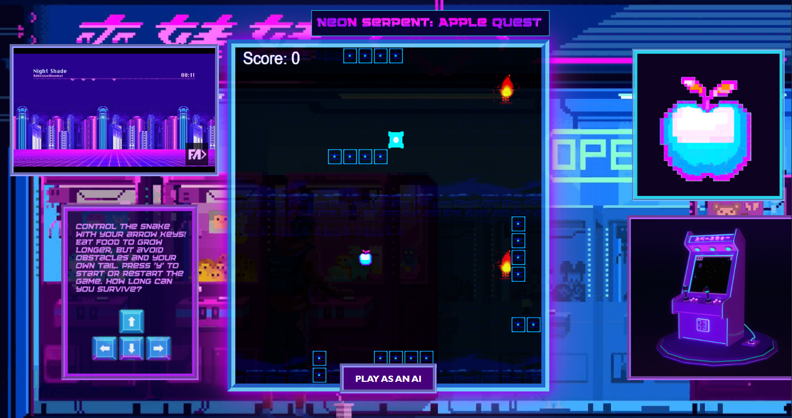
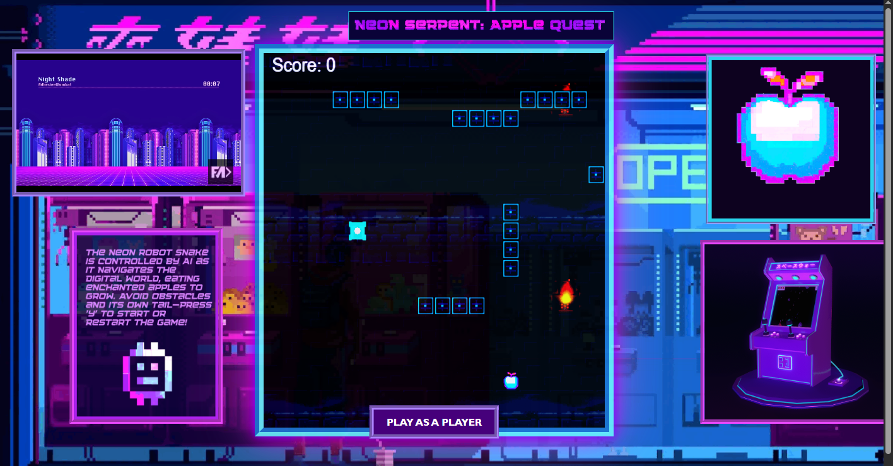

# 🐍 Neon Serpent: 2D Snake Game

**Neon Serpent: Apple Quest** is a 2D snake game built with **HTML, CSS, and JavaScript**.  
Immerse yourself in neon-dungeon vibes where a glowing serpent roams digital mazes, chasing enchanted neon apples to grow and survive.

---

## 🎮 Features
- **Two Game Modes**
  - **Player Mode** – Take control of the neon serpent and guide it through the maze.
  - **AI Mode** – Sit back and watch as the AI serpent plays the game on its own.
- **Neon Vibes & Dungeon Atmosphere** – Futuristic glowing environment with a retro arcade feel.
- **Classic Snake Mechanics with a Twist** – Collect neon apples to grow longer and stronger.


| 📖 Synopsis: *Neon Serpent – Apple Quest* |
|-------------------------------------------|
|  |


| Player Mode |  | AI Mode |
|-------------|--|---------|
|  | |  |

---

## 🚀 How to Play
1. Clone this repository:
   ```bash
   git clone https://github.com/parkqdev/NeonSerpent-2D-Snake-Game.git

2. cd Neonserpent-2D-Snake-Game
3. Open the project in Visual Studio Code and start a Live Server.
4. Run Manuall.html to play the game.

or Play directly in your browser.
https://neonserpent.vercel.app/Manuall.html

---


## 🎮 Controls

- Use the **Arrow Keys** (⬆️ ⬇️ ⬅️ ➡️) to control the serpent in **Player Mode**.  


---

## 🛠️ Built With
- **HTML**
- **CSS**
- **JavaScript (Vanilla)**


## License

This project is licensed under the **Apache License 2.0**.  
See the [LICENSE](./LICENSE) file for details.

